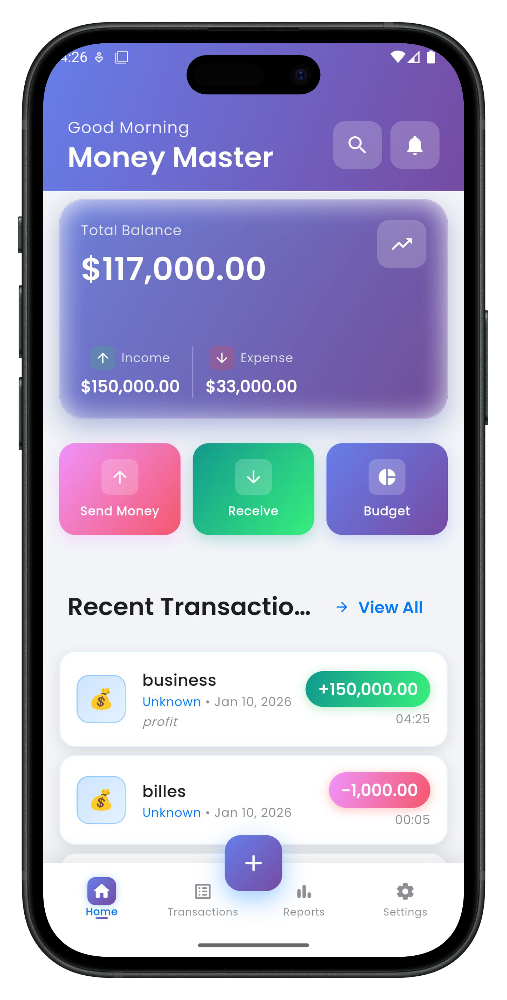
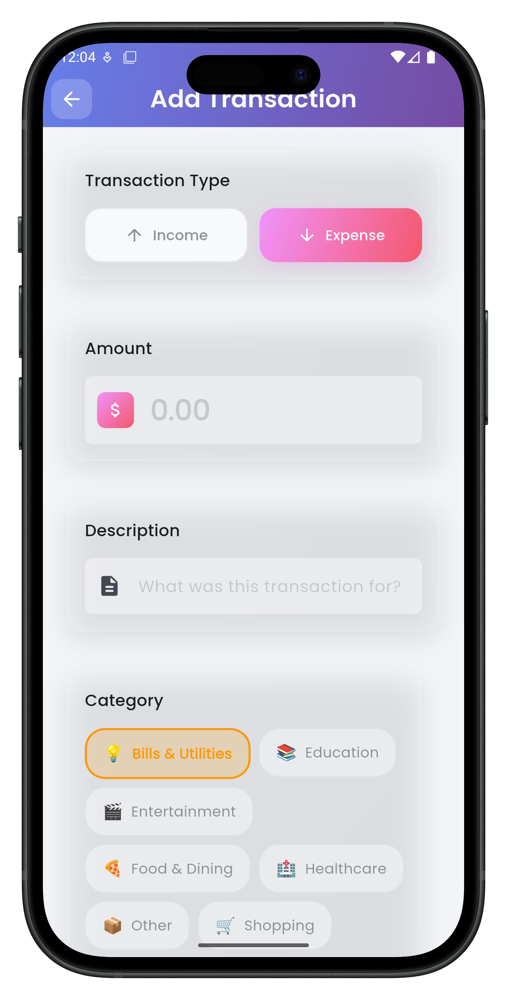
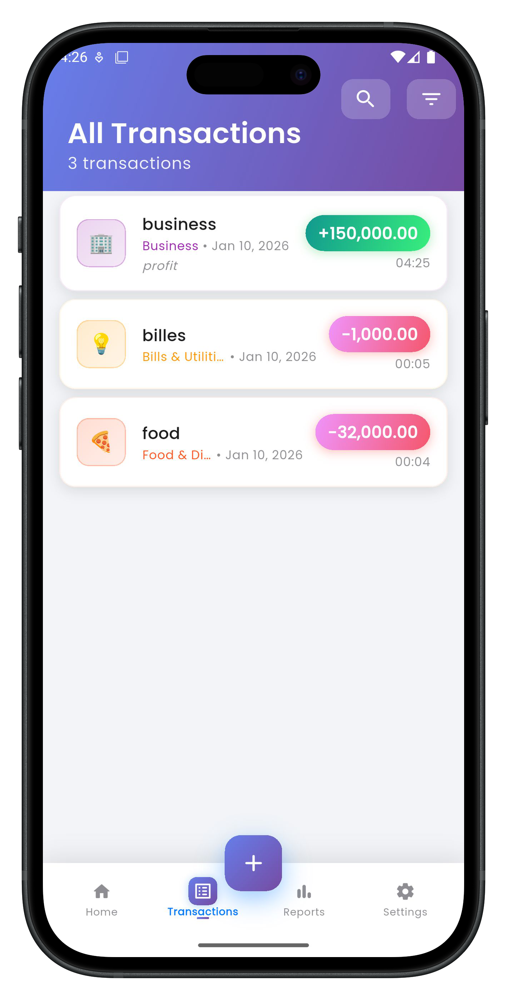
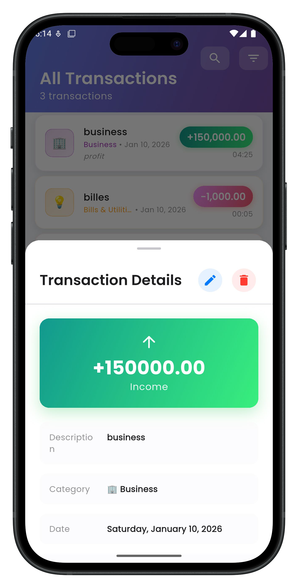
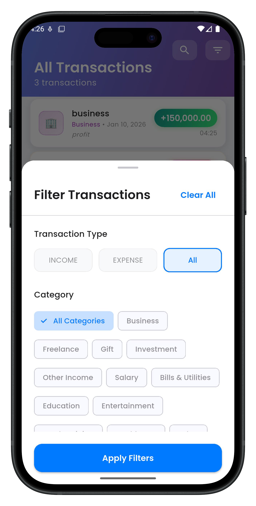
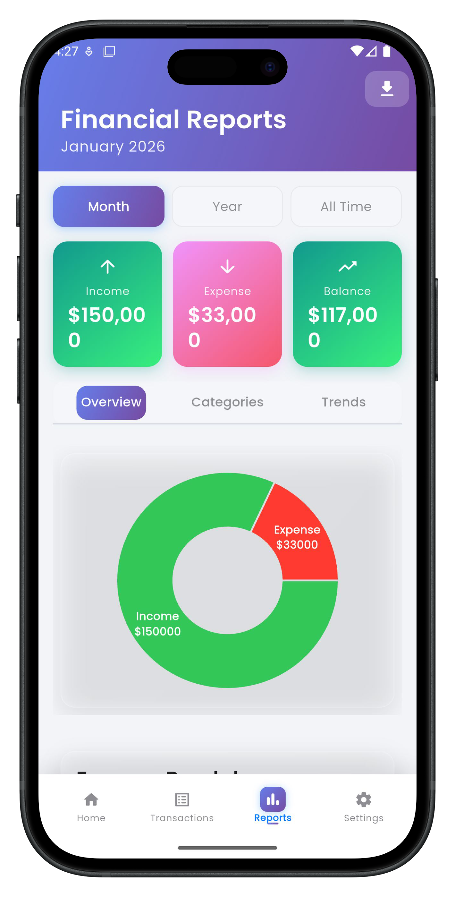
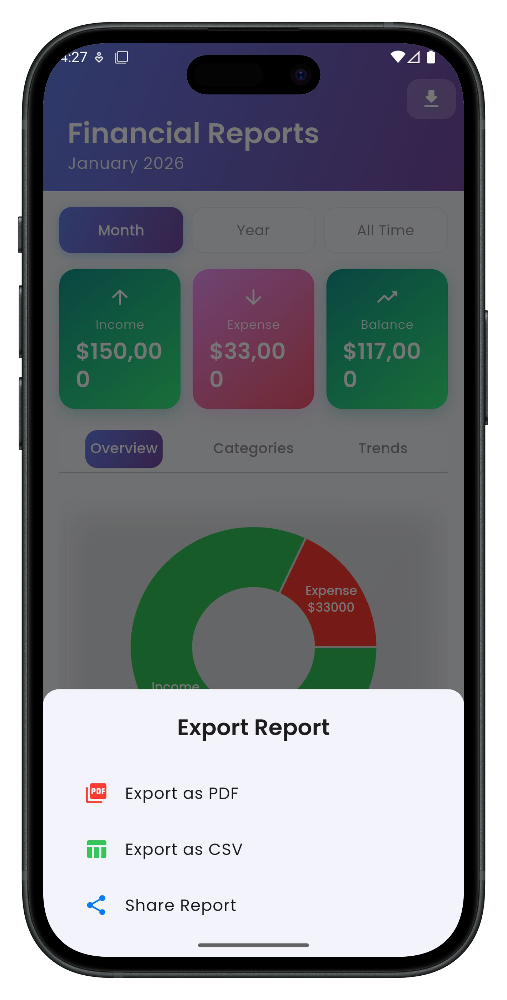
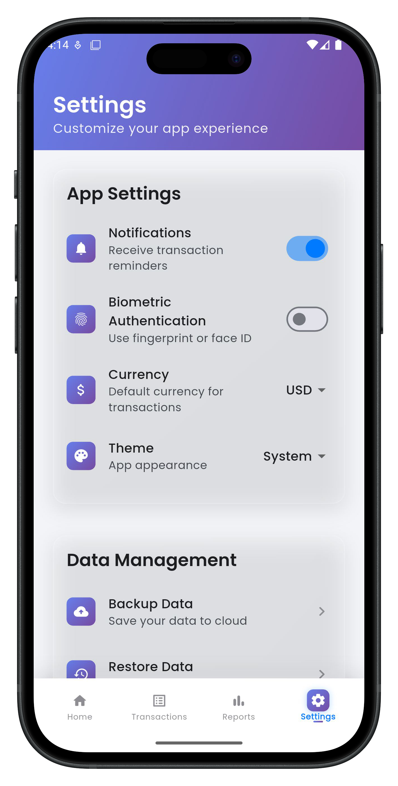

# 💰 Money Master - Personal Finance Tracker

<div align="center">


**A modern, feature-rich personal finance tracking application built with Flutter**

[Features](#-features) • [Screenshots](#-screenshots) • [Getting Started](#-getting-started) • [Architecture](#-architecture) • [Technologies](#-technologies-used)

</div>

---

## 📱 Overview

Money Master is a comprehensive personal finance management application designed to help users track their income and expenses, visualize spending patterns, and manage their budget effectively. Built with Flutter, it offers a beautiful, modern UI with smooth animations and an intuitive user experience.

### ✨ Key Highlights

- 🎨 **Modern UI/UX** - Glassmorphism design with smooth animations
- 📊 **Interactive Charts** - Visual representation of financial data
- 💾 **Local Database** - SQLite for fast, offline-first operation
- 🔄 **State Management** - Provider pattern for efficient state handling
- 🏗️ **Clean Architecture** - Scalable and maintainable codebase
- 🌙 **Dark Mode Ready** - Support for light and dark themes
- 🔍 **Advanced Filtering** - Search and filter transactions by multiple criteria
- 📈 **Financial Reports** - Detailed insights into spending habits

---

## 🚀 Features

### Core Functionality

#### 💸 Transaction Management
- ✅ Add, edit, and delete income/expense transactions
- ✅ Categorize transactions with custom categories
- ✅ Add notes and descriptions to transactions
- ✅ Set date and time for each transaction
- ✅ Swipe gestures for quick actions (edit, delete)

#### 📊 Financial Reports & Analytics
- ✅ Overview pie charts for income vs expense
- ✅ Category-wise expense breakdown
- ✅ 30-day trend analysis with line charts
- ✅ Monthly summary cards
- ✅ Percentage-based spending analysis

#### 🔍 Advanced Search & Filtering
- ✅ Search transactions by description or notes
- ✅ Filter by transaction type (income/expense)
- ✅ Filter by category
- ✅ Filter by date range (today, week, month, custom)
- ✅ Multiple filter combinations

#### 📂 Data Management
- ✅ Export data to CSV format
- ✅ Export reports to PDF
- ✅ Data backup and restore
- ✅ Clear all data option

#### ⚙️ Settings & Customization
- ✅ Notification preferences
- ✅ Biometric authentication support
- ✅ Currency selection (USD, EUR, GBP, EGP)
- ✅ Theme customization (Light, Dark, System)
- ✅ App information and support

### UI/UX Features

- 🎭 **Glassmorphism Effects** - Modern frosted glass design
- ✨ **Smooth Animations** - Staggered list animations and transitions
- 📱 **Haptic Feedback** - Tactile responses for user actions
- 🎨 **Gradient Designs** - Beautiful color gradients throughout
- 🔄 **Pull-to-Refresh** - Update data with simple gesture
- 💫 **Particle Effects** - Animated background elements
- 📐 **Responsive Design** - Adapts to different screen sizes

---

## 📸 Screenshots

<div align="center">
  
  
  
  
  
  
  
   
</div>

---

## 🏗️ Architecture

This project follows **Clean Architecture** principles with clear separation of concerns:

```
lib/
├── core/                          # Core utilities and constants
│   ├── constants/
│   │   ├── app_colors.dart       # Color palette
│   │   ├── app_strings.dart      # String constants
│   │   └── app_themes.dart       # Theme configuration
│   ├── utils/                     # Utility classes
│   └── errors/                    # Error handling
│
├── data/                          # Data Layer
│   ├── models/                    # Data models
│   │   ├── transaction_model.dart
│   │   └── category_model.dart
│   ├── datasources/              # Data sources
│   │   └── local/
│   │       └── database_helper.dart
│   └── repositories/             # Repository implementations
│       ├── transaction_repository_impl.dart
│       └── category_repository_impl.dart
│
├── domain/                        # Domain Layer (Business Logic)
│   ├── entities/                  # Business entities
│   │   ├── transaction.dart
│   │   └── category.dart
│   ├── repositories/             # Repository interfaces
│   │   ├── transaction_repository.dart
│   │   └── category_repository.dart
│   └── usecases/                 # Business use cases
│
├── presentation/                  # Presentation Layer (UI)
│   ├── providers/                # State management
│   │   ├── transaction_provider.dart
│   │   └── category_provider.dart
│   ├── screens/                  # App screens
│   │   ├── home/
│   │   ├── transactions/
│   │   ├── reports/
│   │   └── settings/
│   └── widgets/                  # Reusable widgets
│       ├── glassmorphism_card.dart
│       ├── animated_balance_card.dart
│       └── modern_transaction_card.dart
│
└── main.dart                      # App entry point
```

### Architecture Layers

1. **Presentation Layer** - UI components, screens, and state management
2. **Domain Layer** - Business logic, entities, and use cases
3. **Data Layer** - Data sources, models, and repository implementations

---

## 🛠️ Technologies Used

### Framework & Language
- **Flutter 3.0+** - UI framework
- **Dart 3.0+** - Programming language

### State Management
- **Provider 6.1.1** - State management solution

### Database
- **sqflite 2.3.0** - SQLite database
- **path 1.8.3** - File path utilities

### UI Components & Charts
- **fl_chart 0.64.0** - Interactive charts
- **google_fonts 6.1.0** - Custom fonts
- **flutter_animate 4.2.0** - Animation library
- **flutter_staggered_animations 1.1.1** - List animations
- **glassmorphism 3.0.0** - Glass effect widgets

### Utilities
- **intl 0.18.1** - Internationalization and date formatting
- **uuid 4.1.0** - Unique ID generation
- **equatable 2.0.5** - Value equality
- **flutter_slidable 3.0.1** - Swipe actions
- **table_calendar 3.0.9** - Calendar widget

### Development Tools
- **flutter_lints 3.0.0** - Code linting
- **mockito 5.4.2** - Testing framework
- **build_runner 2.4.7** - Code generation

---

## 🚀 Getting Started

### Prerequisites

- Flutter SDK (3.0.0 or higher)
- Dart SDK (3.0.0 or higher)
- Android Studio / VS Code
- iOS Simulator / Android Emulator

### Installation

1. **Clone the repository**
   ```bash
   git clone https://github.com/yourusername/money-master.git
   cd money-master
   ```

2. **Install dependencies**
   ```bash
   flutter pub get
   ```

3. **Run the app**
   ```bash
   flutter run
   ```

### Build for Production

**Android:**
```bash
flutter build apk --release
# or for App Bundle
flutter build appbundle --release
```

**iOS:**
```bash
flutter build ios --release
```

---

## 🧪 Testing

### Run Tests
```bash
# Run all tests
flutter test

# Run tests with coverage
flutter test --coverage

# Run specific test file
flutter test test/unit/transaction_test.dart
```

### Test Structure
```
test/
├── unit/                 # Unit tests
│   ├── models/
│   ├── repositories/
│   └── providers/
├── widget/              # Widget tests
│   └── screens/
└── integration/         # Integration tests
```

---

## 📦 Project Structure Details

### Key Components

#### Database Schema
```sql
-- Transactions Table
CREATE TABLE transactions (
  id TEXT PRIMARY KEY,
  amount REAL NOT NULL,
  description TEXT NOT NULL,
  category_id TEXT NOT NULL,
  type TEXT NOT NULL,
  date TEXT NOT NULL,
  created_at TEXT NOT NULL,
  notes TEXT,
  FOREIGN KEY (category_id) REFERENCES categories (id)
);

-- Categories Table
CREATE TABLE categories (
  id TEXT PRIMARY KEY,
  name TEXT NOT NULL,
  icon TEXT NOT NULL,
  color_hex TEXT NOT NULL,
  type TEXT NOT NULL,
  is_default INTEGER DEFAULT 0,
  created_at TEXT NOT NULL
);
```

#### State Management Pattern

The app uses **Provider** for state management with a clear separation:

```dart
// Provider setup in main.dart
MultiProvider(
  providers: [
    ChangeNotifierProvider(
      create: (_) => TransactionProvider(repository),
    ),
    ChangeNotifierProvider(
      create: (_) => CategoryProvider(repository),
    ),
  ],
  child: MaterialApp(...),
)
```

---

## 🎨 Design System

### Color Palette

```dart
// Primary Colors
Primary: #007AFF (iOS Blue)
Secondary: #34C759 (iOS Green)
Accent: #FF9500 (iOS Orange)

// Transaction Colors
Income: #34C759 (Green)
Expense: #FF3B30 (Red)

// Status Colors
Success: #34C759
Error: #FF3B30
Warning: #FF9500
Info: #007AFF
```

### Typography

- **Font Family:** Poppins (via Google Fonts)
- **Headlines:** Bold, 24-32px
- **Body Text:** Regular, 14-16px
- **Captions:** Regular, 12px

---

## 🔐 Security & Privacy

- ✅ All data stored locally on device
- ✅ No external API calls or data sharing
- ✅ Optional biometric authentication
- ✅ Secure storage for sensitive data
- ✅ No user tracking or analytics

---

## 🗺️ Roadmap

### Planned Features

- [ ] **Cloud Sync** - Sync data across devices
- [ ] **Budget Management** - Set and track monthly budgets
- [ ] **Recurring Transactions** - Auto-add regular expenses
- [ ] **Multi-Currency Support** - Handle multiple currencies
- [ ] **Receipt Scanning** - OCR for receipt data extraction
- [ ] **Investment Tracking** - Track stocks and investments
- [ ] **Bill Reminders** - Notifications for upcoming bills
- [ ] **Expense Splitting** - Share expenses with others
- [ ] **Financial Goals** - Set and track savings goals
- [ ] **Data Encryption** - Enhanced data security

### Version History

- **v1.0.0** (Current) - Initial release with core features
  - Transaction management
  - Reports and charts
  - Search and filtering
  - Settings and customization

---

## 🤝 Contributing

Contributions are welcome! Please follow these steps:

1. Fork the repository
2. Create a feature branch (`git checkout -b feature/AmazingFeature`)
3. Commit your changes (`git commit -m 'Add some AmazingFeature'`)
4. Push to the branch (`git push origin feature/AmazingFeature`)
5. Open a Pull Request

### Coding Standards

- Follow [Flutter Style Guide](https://flutter.dev/docs/development/tools/formatting)
- Write meaningful commit messages
- Add tests for new features
- Update documentation as needed

---

## 📄 License

This project is licensed under the MIT License - see the [LICENSE](LICENSE) file for details.

```
MIT License

Copyright (c) 2024 Money Master

Permission is hereby granted, free of charge, to any person obtaining a copy
of this software and associated documentation files (the "Software"), to deal
in the Software without restriction...
```

---

## 👨‍💻 Author

**Ahmed Mohamed Ali**
- GitHub: [@ahmed-flutter-dev](https://github.com/ahmed-flutter-dev)
- LinkedIn: [ahmed-mohamed-flutter](https://linkedin.com/in/ahmed-mohamed-flutter)
- Email: ahmed.mohamed.dev@gmail.com

---

## 🙏 Acknowledgments

- [Flutter Team](https://flutter.dev) - For the amazing framework
- [fl_chart](https://github.com/imaNNeo/fl_chart) - For beautiful charts
- [Google Fonts](https://fonts.google.com) - For typography
- Flutter Community - For helpful packages and resources

---

## ⭐ Show Your Support

Give a ⭐️ if this project helped you!

---

<div align="center">

**Made with ❤️ using Flutter**

[⬆ Back to Top](#-money-master---personal-finance-tracker)

</div>
